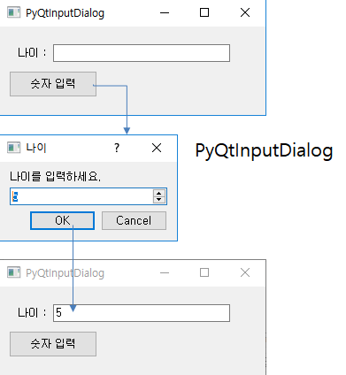
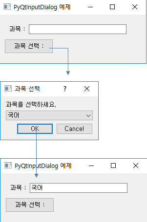
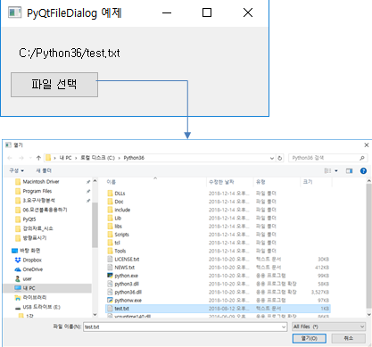

# PyQt5 기초(Dialog)

## 1. 다이얼로그(Dialog) 소개

> GUI 프로그래밍에서 사용자와의 상호작용을 위해 사용되는 윈도우

- PyQt는 다양한 형태의 Dialog 클래스를 제공
- 목적에 맞는 다이얼로그 클래스를 사용하거나 상속을 받은 후 새로운 클래스를 정의해서 사용하면 된다.

## 2. QInputDialog

> 숫자입력 버튼을 누르면 나이 입력을 위한 다이얼로그가 나타나서 입력 값을 받아 처리
>
> 과목들을 선택할 수 있는 입력 다이얼로그를 표시한 후, 선택된 항목을 받아 표시

```python
class CInputDialogWindow(QMainWindow):
    def __init__(self):
        super().__init__()
        self.setupUI()

    def setupUI(self):
        self.setWindowTitle("PyQtInputDialog 예제")
        self.setGeometry(100,100,300,100)

        self.label = QLabel("나이 : ", self)
        self.label.move(20,20)
        self.label.resize(150,20)

        self.lineEdit = QLineEdit("", self)
        self.lineEdit.move(60,20)
        self.lineEdit.resize(200,20)
        self.lineEdit.setReadOnly(True)	# 직접 입력 안됨

        self.btnSave = QPushButton("숫자 입력", self)
        self.btnSave.move(10, 50)
        self.btnSave.clicked.connect(self.btnInput_clicked)

    def btnInput_clicked(self):
        # (text, ok)라는 튜플 형태로 값을 반환
        text, ok = QInputDialog.getInt(self, '나이', '나이를 입력하세요.')
        # ok는 사용자가 OK 버튼을 누른 경우에 True 값을 가짐.
        if ok:
            self.lineEdit.setText(str(text))
            
	''' getItem() 사용
	def btnInput_clicked(self):
        items = ("국어", "영어", "수학")
        item, ok = QInputDialog.getItem(self, "과목 선택", "과목을 선택하세요.", items, 0, False)
        if ok and item:
            self.lineEdit.setText(item)
    '''
if __name__ == "__main__":
    app = QApplication(sys.argv)
    window = CInputDialogWindow()
    window.show()
    app.exec_()
```

- getDouble() : 사용자로부터 실수를 입력받을 때
- getText() : 사용자로부터 문자열을 입력받을 때
- getItem() : 항목을 선택할 때 



## 3. QFileDialog

> 사용자가 파일이나 디렉터리를 선택할 수 있게 하는 다이얼로그

```python
class CFileDialogWindow(QMainWindow):
    def __init__(self):
        super().__init__()
        self.setupUI()

    def setupUI(self):
        self.setWindowTitle("PyQtFileDialog 예제")
        self.setGeometry(100,100,300,100)

        self.label = QLabel("파일 : ", self)
        self.label.move(20,20)
        self.label.resize(150,20)

        self.btnSave = QPushButton("파일 선택", self)
        self.btnSave.move(10, 50)
        self.btnSave.clicked.connect(self.btnInput_clicked)

    def btnInput_clicked(self):
        fname = QFileDialog.getOpenFileName(self)
        self.label.setText(fname[0])
            
if __name__ == "__main__":
    app = QApplication(sys.argv)
    window = CFileDialogWindow()
    window.show()
    app.exec_()
```

