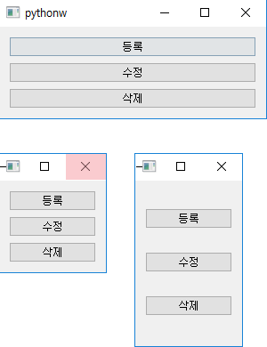
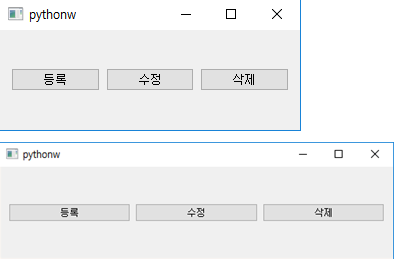
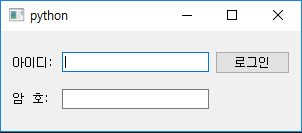

# PyQt(Layout)

> GUI 프로그래밍에서 위젯을 배치하기 위한 방법 및 도구

## 1. QVBoxLayout (수직 박스 레이아웃), QHBoxLayout (수평 박스 레이아웃)

> 수직(세로) 방향으로 위젯들을 배치할 때 사용하는 레이아웃
>
> 행(가로) 방향으로 위젯들을 배치할 때 사용하는 레이아웃

```python
class MyWindow(QWidget):
    def __init__(self):
        super().__init__()
        self.setGeometry(100, 100, 300, 100)

        self.pushButton1= QPushButton("등록")
        self.pushButton2= QPushButton("수정")
        self.pushButton3= QPushButton("삭제")

        layout = QVBoxLayout() # 수직 박스 레이아웃
        # layout = QVBoxLayout() # 수평 박스 레이아웃
        layout.addWidget(self.pushButton1)
        layout.addWidget(self.pushButton2)
        layout.addWidget(self.pushButton3)

        self.setLayout(layout)

if __name__ == "__main__":
    app = QApplication(sys.argv)
    mywindow = MyWindow()
    mywindow.show()
    app.exec_()
```



## 2. QGridLayout (그리드 레이아웃)

> 격자(그리드) 형태로 위젯들을 배치할 때 사용하는 레이아웃

```python
class MyWindow(QWidget):
    def __init__(self):
        super().__init__()
        self.setGeometry(100, 100, 300, 100)

        self.label1 = QLabel("아이디: ")
        self.label2 = QLabel("암  호: ")
        self.lineEdit1 = QLineEdit()
        self.lineEdit2 = QLineEdit()
        self.pushButton1= QPushButton("로그인")

        layout = QGridLayout()

        layout.addWidget(self.label1, 0, 0)
        layout.addWidget(self.lineEdit1, 0, 1)
        layout.addWidget(self.pushButton1, 0, 2)

        layout.addWidget(self.label2, 1, 0)
        layout.addWidget(self.lineEdit2, 1, 1)

        self.setLayout(layout)
        
if __name__ == "__main__":
    app = QApplication(sys.argv)
    mywindow = MyWindow()
    mywindow.show()
    app.exec_()
```

