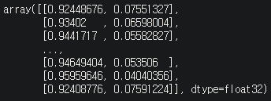
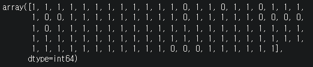
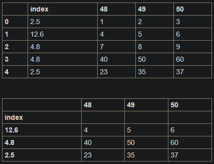
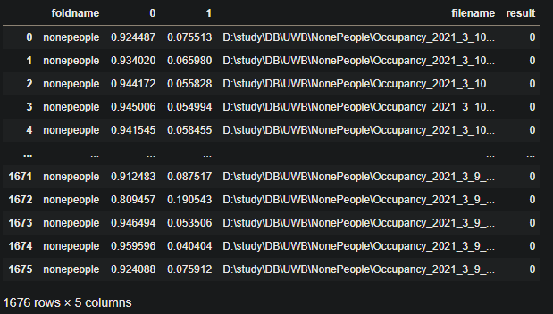
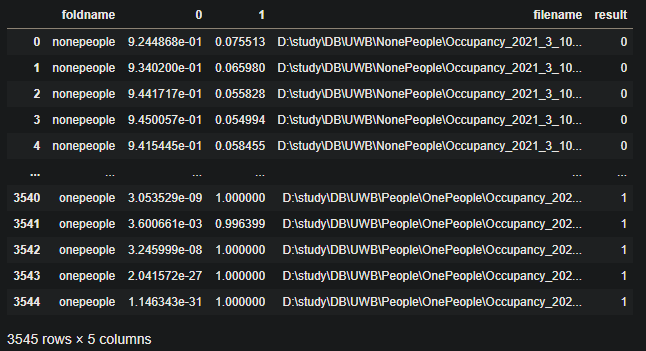

# panda 결과출력

> 2021.03.29
>
> 김성웅 연구원

## 0. 개요

- `evaluate` 과정에서 `loss`가 생긴 파일 확인을 위해 `predict_classes`로 결과 확인
- 결과와 파일명을 엑셀화 시켜 결과 확인 용이
- 차후, `loss`를 줄이기 위한 작업에 도움을 줄 수 있음.


## 1. predict VS predict_classes

### - predict 

​	결과를 class별 확률로 보여줌.



### - predict_classes

​	가장 확률이 높은 클래스 인덱스를 알려줌.




## 2. panda 기초

### - Dataframe 만들기

```python
import pandas as pd

f = pd.DataFrame(np.array([[1, 2, 3], [4, 5, 6]]))

print(df.shape)		# (2, 3)
print(len(df.index))	# 2
list(df.columns)	# [0,1,2]
```

```python
my_dict = {"a": ['1', '3'], "b": ['1', '2'], "c": ['2', '4']}
display(pd.DataFrame(my_dict))
```


### - Dataframe에서 특정 컬럼이나 로우(인덱스) 선택

```python
df = pd.DataFrame({"A":[1,4,7], "B":[2,5,8], "C":[3,6,9]})

# row
display(df.iloc[0])
display(df.loc[0])
''' A 1
	B 2
	C 3'''

# column
display(df.loc[:,'A'])
display(df['A'])
''' A 1
	B 4
	C 7'''

# 특정 row, column을 선택하기
display(df.ix[0]['A'])
display(df.loc[0]['B'])
''' 1
	2'''
```

### - Dataframe에 컬럼, 로우, 인덱스 추가

```python
df = pd.DataFrame({"A":[1,4,7], "B":[2,5,8], "C":[3,6,9]})

# row 추가
df.loc[2] = [11, 12, 13]

# append로 row 추가
df = df.append(a)
df = df.reset_index(drop=True)	# 배열 인덱스 0부터 다시 정렬

# column 추가
df['filename'] = pd.Series([3, 4, 5])
df.loc[:, 'D'] = pd.Series(['5', '6', '7'], index=df.index)
```

### - Dataframe의 인덱스, 컬럼, 데이터 삭제

```python
df = pd.DataFrame(data=np.array([[1, 2, 3], [4, 5, 6], [7, 8, 9]]), columns=['A', 'B', 'C'])

# drop axis의 경우 column이면 1, row이면 0
df.drop('A', axis=1, inplace=True)	# column 'A' 삭제

# 인덱스를 통한 row 삭제
df.drop(df.index[1])
```

```python
df = pd.DataFrame(data=np.array([[1, 2, 3], [4, 5, 6], [7, 8, 9], [40, 50, 60], [23, 35, 37]]), index= [2.5, 12.6, 4.8, 4.8, 2.5], columns=[48, 49, 50])

# 중복되는 row 제거
# keep 키워드를 통해 중복된 것들 중 어떤 걸 킵할지 정할 수 있다.
df = df.drop_duplicates(subset='index', keep='last').set_index('index')
```



### -  Dataframe 데이터 수정

```python
df = pd.DataFrame(data=np.array([[1, 2, 3], [1, 5, 6], [7, 8, 9]]), columns=['A', 'B', 'C'])

# 인덱스=0, 컬럼=A의 데이터를 0으로 수정
df.ix[0]['A'] = 0
```

### - csv 파일 읽기 및 생성

```python
data = pd.read_csv("./dataset.csv")
data = pandas.read_csv('dataPerson.txt',delimiter='\t')
data = pd.read_csv("./dataset-no-column.csv", names=['A', 'B', 'C', 'D'])
```

- csv, txt 파일 모두 읽어 올수 있음.
- `header=None` 인덱스를 자동으로 만들어 줌
- column 이름을 직접 주고 싶다면 `names` 인자를 사용하면 된다.
- `sep` = 구분자 기호, default는 ',' , `index` = True이면 index를 출력, `encoding` = 인코딩 설정, 보통 한글은 'utf-8'로 설정


```python
df = pd.DataFrame({'c0':[0,1,2],'c1':[1,2,3],'c2':[4,5,6],'c3':[7,8,9]})
df.to_csv("test.csv", index=False)
```
- `index=False`옵션은 위의 출력된 Dataframe에 자동으로 추가된 인덱스 없이 저장
- 읽을때와 유사하게 인자 사용가능


## 3. UWB 재실 결과

- predict 및 predict_classes 결과 저장

    ```python
    # predictions
    predictions = model.predict(init_data_nonepeople)
    predictions2 = model.predict(init_data_morepeople)
    predictions3 = model.predict(init_data_onepeople)

    # predict_classes
    predictions_classes = model.predict_classes(init_data_nonepeople)
    predictions2_classes = model.predict_classes(init_data_morepeople)
    predictions3_classes = model.predict_classes(init_data_onepeople)
    ```
    
- DataFrame 생성

    ```python
    import pandas as pd

    df = pd.DataFrame(predictions)
    df['filename'] = pd.Series(names_nonepeople)
    df['result'] = pd.Series(predictions_classes)
    df.insert(0, 'foldname', 'nonepeople')

    display(df)
    ```
    
    
    
- 결과 추가

    ```python
    df2 = pd.DataFrame(predictions2)
    df2['filename'] = pd.Series(names_morepeople)
    df2['result'] = pd.Series(predictions2_classes)
    df2.insert(0, 'foldname', 'morepeople')
    df = df.append(df2)
    
    df3 = pd.DataFrame(predictions3)
    df3['filename'] = pd.Series(names_onepeople)
    df3['result'] = pd.Series(predictions3_classes)
    df3.insert(0, 'foldname', 'onepeople')
    df = df.append(df3)
    
    df = df.reset_index(drop=True)	# 인덱스 정리
    display(df)
    ```

    

- 파일 출력

    ```python
    df.to_csv('predict_result.csv', index = False)
    ```

    
